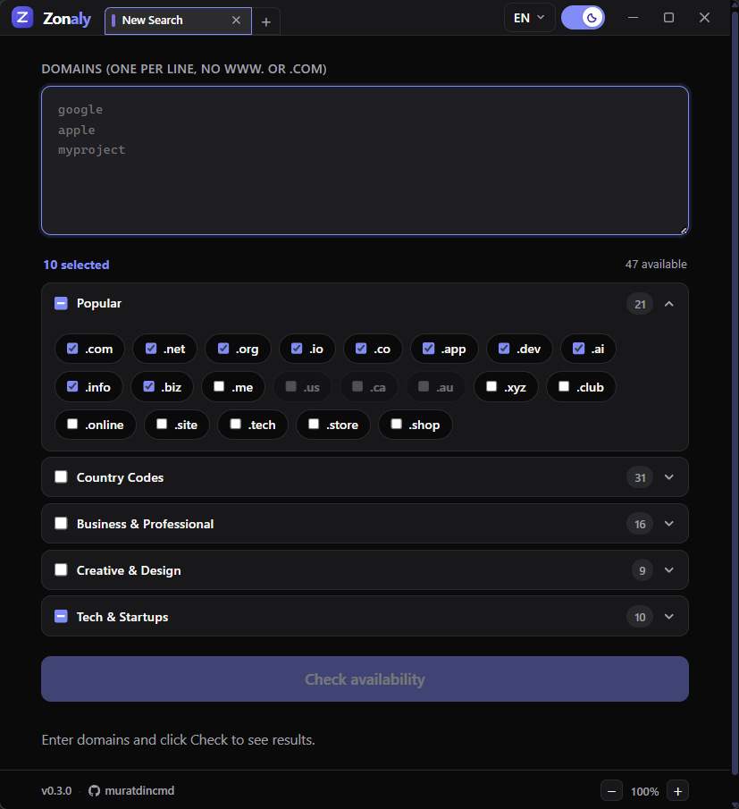
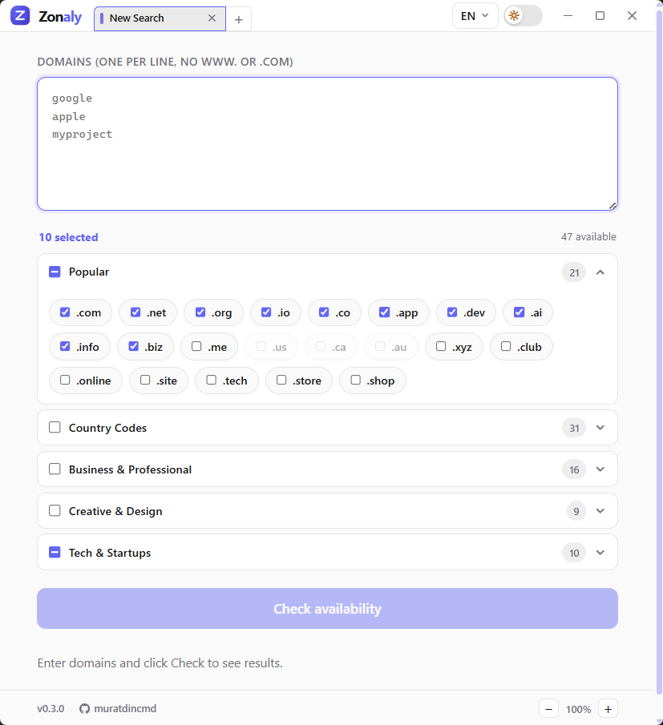
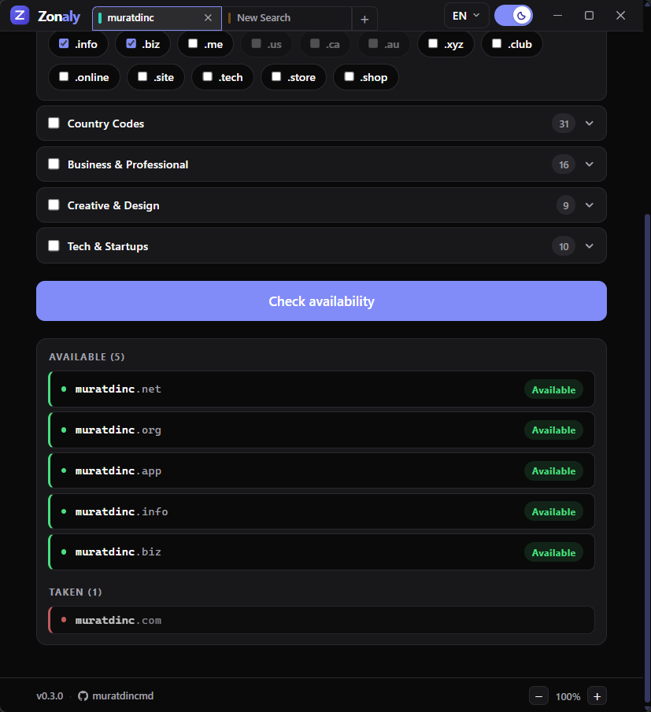
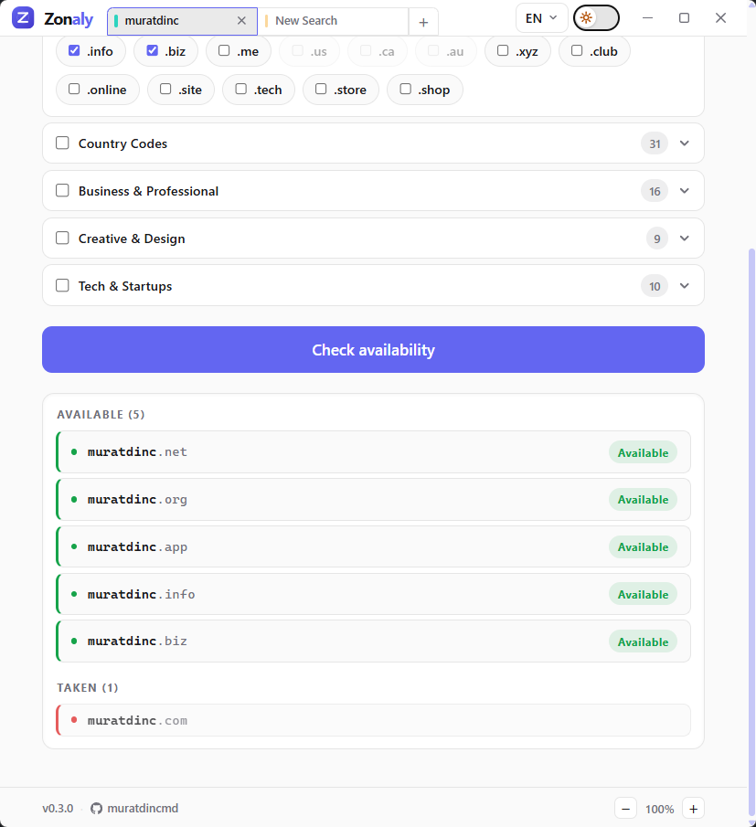

# Zonaly


**Domain availability checker** — paste domain names, pick TLD extensions, and get real-time parallel results in a clean desktop app.

Built with [Tauri v2](https://v2.tauri.app/) (Rust) + React + TypeScript. Queries the [RDAP](https://about.rdap.org/) protocol — the modern, structured successor to WHOIS.

---

## Features

- **Smart input sanitization** — paste full URLs (`https://example.com/page`) and the app strips protocols, `www.`, TLD suffixes, and paths automatically
- **Categorized TLD picker** — 5 collapsible categories (Popular, Country Codes, Business & Professional, Creative & Design, Tech & Startups), select-all per category, selected/available count
- **Parallel RDAP queries** — all name × TLD combinations checked concurrently (up to 10 at a time)
- **Streaming results** — Available / Taken / Error groups appear as results arrive, preserving your input order
- **Modern results UI** — colored left-border accent per status, "Available" badge, custom thin scrollbar
- **14 languages** — EN, TR, DE, ES, FR, IT, PT, RU, ZH, JA, KO, AR, NL, PL; auto-detected from system locale
- **RTL support** — full right-to-left layout when Arabic is selected
- **Animated theme toggle** — sliding switch with sun/moon icon inside the thumb
- **Fixed header & footer** — header always visible at top, footer always at bottom
- **UI scale control** — resize the content area from 70% to 150% via footer +/− buttons, persisted across sessions
- **Custom app icon** — indigo Z lettermark with globe arc overlays
- **Custom title bar (Windows)** — branded frameless title bar with logo, tab bar, and window controls; native chrome on macOS/Linux
- **Multi-tab support** — up to 20 independent tabs, each with isolated input, TLD selection and results; keyboard shortcuts (Ctrl+T/W/Tab/1–9)
- **Splashscreen** — transparent animated splash while the app loads, eliminating flash of unstyled content
- **Installer branding** — custom NSIS banner/sidebar (Windows) and DMG background (macOS); icon cache auto-refreshed after install

---

## Screenshots

<p align="center">
  
  &nbsp;
  
</p>

<p align="center">
  
  &nbsp;
  
</p>

---

# For users

## Download

Get the latest installer for your platform from the [Releases](https://github.com/muratdincmd/zonaly/releases) page:

| Platform | File |
|----------|------|
| Windows | `.msi` installer |
| macOS (Apple Silicon) | `.dmg` |
| macOS (Intel) | `.dmg` |
| Linux | `.AppImage` or `.deb` |

No additional runtime or dependencies needed — the installer is self-contained.

## Usage

1. Type or paste domain names — one per line, bare names only (e.g. `google`, `myproject`)  
   Full URLs are accepted and cleaned automatically (`https://www.example.com/page` → `example`)
2. Select TLD extensions from the categorized picker, or use "Select all" per category
3. Click **Check availability**
4. Results stream in and are split into **Available** (green) and **Taken** (red) groups
5. Click any Taken domain to see WHOIS details *(coming in Phase 3)*

## Supported languages

| Code | Language | RTL |
|------|----------|-----|
| EN | English | — |
| TR | Turkish | — |
| DE | German | — |
| ES | Spanish | — |
| FR | French | — |
| IT | Italian | — |
| PT | Portuguese | — |
| RU | Russian | — |
| ZH | Chinese (Simplified) | — |
| JA | Japanese | — |
| KO | Korean | — |
| AR | Arabic | ✓ |
| NL | Dutch | — |
| PL | Polish | — |

Language is auto-detected from your system locale and saved across sessions. Switch at any time via the language selector in the top-right corner.

---

# For developers

## Architecture

```
User input
  └─► sanitize (strip protocol / www / TLD / path)
        └─► parse names × selected TLDs → Vec<DomainQuery>
              └─► invoke("check_domains")          [Tauri command]
                    └─► tokio::task per pair, semaphore(10)
                          └─► IANA RDAP bootstrap → GET {base}/domain/{name}.{tld}
                                ├─ HTTP 200 → Taken    ─► emit("domain-result")
                                ├─ HTTP 404 → Available ► emit("domain-result")
                                └─ error   → Error    ─► emit("domain-result")
              ◄── listen("domain-result") → accumulate into ordered Map
```

[RDAP](https://about.rdap.org/) is an HTTPS/JSON protocol — no text parsing needed for availability checks. The app fetches the [IANA RDAP bootstrap](https://data.iana.org/rdap/dns.json) on first run to discover the correct server per TLD. Coverage is broad for gTLDs (`.com`, `.net`, `.org`, `.io`, `.app`, `.dev`, `.ai` …) and most ccTLDs; ccTLDs without RDAP support are shown as disabled in the picker with a tooltip.

## Project structure

```
zonaly/
├── scripts/                     # icon generation (icon.svg + generate-icons.mjs)
├── src/                         # React + TypeScript frontend
│   ├── App.tsx                  # single-page layout + state
│   ├── components/              # AppLogo, AppFooter, DomainInput, ExtensionPicker,
│   │                            # LanguageSelector, ResultsList, ResultRow,
│   │                            # ThemeToggle, Toast
│   ├── hooks/                   # useDomainCheck, useScale, useToast
│   ├── i18n/locales/            # 14 language JSON files
│   ├── theme/ThemeProvider.tsx  # system detect + manual override
│   ├── types/domain.ts          # TypeScript mirrors of Rust serde types
│   └── utils/sanitizeDomains.ts # URL → bare domain name sanitizer
└── src-tauri/                   # Rust backend
    └── src/
        ├── commands.rs          # check_domains + open_url Tauri commands
        ├── types.rs             # DomainQuery / DomainResult / DomainStatus
        └── rdap/                # IANA bootstrap cache + per-domain HTTP client
```

## Prerequisites

| Tool | Version |
|------|---------|
| [Rust](https://rustup.rs/) | 1.80+ |
| [Node.js](https://nodejs.org/) | 20+ |
| npm | 10+ |
| [Tauri system deps](https://v2.tauri.app/start/prerequisites/) | platform-specific |

**Windows:** [Microsoft C++ Build Tools](https://visualstudio.microsoft.com/visual-cpp-build-tools/) + WebView2 (pre-installed on Windows 11).

**Linux:** `libwebkit2gtk-4.1-dev libappindicator3-dev librsvg2-dev patchelf` (see [ci.yml](.github/workflows/ci.yml) for exact packages).

## Setup & commands

```bash
git clone https://github.com/muratdincmd/zonaly.git
cd zonaly
npm install
npm run tauri dev        # hot-reload for both Rust and React
```

```bash
npm run typecheck        # tsc --noEmit
npm run tauri build      # production bundle → src-tauri/target/release/bundle/

# From src-tauri/
cargo check
cargo clippy
cargo fmt

# Regenerate app icons after editing scripts/icon.svg
node scripts/generate-icons.mjs
```

## Roadmap

| Phase | Status | Description |
|-------|--------|-------------|
| 1 — Setup | ✅ Done | Tauri + React + TS scaffold, i18n, theme |
| 2 — Core | ✅ Done | Input → parallel RDAP queries → streaming results |
| 2.x — UX | ✅ Done | Categorized TLD picker, sanitization, 14 languages, RTL, footer |
| 3 — Shell | ✅ Done | Custom title bar, multi-tab support, splashscreen, installer branding |
| 4 — Details | 🔜 Next | WHOIS popup (registrar, dates, nameservers), port-43 fallback for non-RDAP ccTLDs |
| 5 — Polish | ⬜ Planned | Result animations, error UX, network-offline detection, MSI/DMG/AppImage packaging |

## Contributing

See [CONTRIBUTING.md](CONTRIBUTING.md) for the branching strategy, versioning policy, and release process.

---

## License

[MIT](LICENSE)
